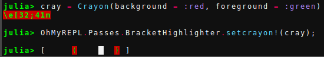

# Bracket highlighting


Makes matching brackets highlighted when the cursor is between an opening and closing bracket.

## Settings

!!! info
    Please refer to the [`Crayons.jl` documentation](https://github.com/KristofferC/Crayons.jl) while reading this section.

It is possbile to change the way the highlighted bracket is printed with the function

```OhMyREPL.Passes.BracketHighlighter.setcrayon!(::Crayon)```


