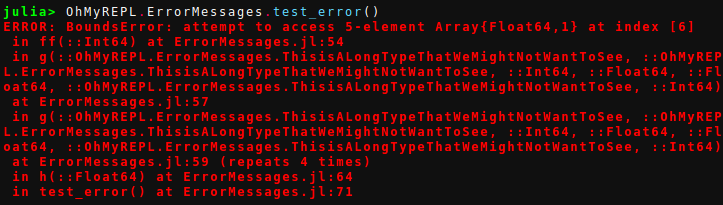

# Error Messages

!!! warn
    This feature only works on Julia v0.5. Error messages on 0.6 have been improved enough that this feature is not needed.

`OhMyREPL` provides what can be argued to be a bit nicer error messages than Julia's default ones.

The difference between the standard error messages and the ones from `OhMyREPL` is shown below:

## Default error message

## `OhMyREPL` error message

The differences between the two are:

* Stack trace in `OhMyREPL` is printed in reverse. This makes the top stack frame which is the one that is likely most interesting be closest to the cursor and will prevent the need to scroll to it for long traces.
* The actual error message is in the bottom.
* Instead of everything being in bold red the color and boldness is varied to try to highlight the information that is likely to be more important.
* Each stack frame has a number. By entering the number in the REPL and then pressing <CTRL + Q> the editor will open at the file and line number of that stack frame. For this to work, set the `"EDITOR"` environment variable, for example `ENV["EDITOR"] = subl` for Sublime Text on linux.

## Settings

There are a few environment variables that can be set to change the way the error messages are printed.

* `"JULIA_ERR_LINFO_COLOR"` can be set to one of the symbols in `Base.text_colors` and determines how the file name and line number is printed.

* `"JULIA_ERR_FUNCDEF_COLOR"` can be set to one of the symbols in `Base.text_colors` and determines how function name is printed.

* `"JULIA_ERR_LINFO_NEWLINE` can be set to `true` or `false` and determines if the line info should be printed on a new line.

