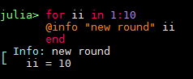
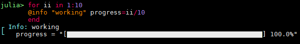
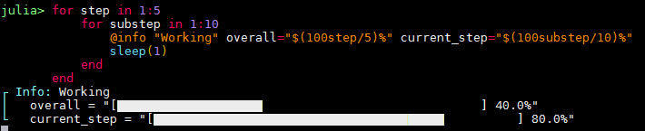

T
# Console Logging

## Log Message Overwriting
To prevent the console overflowing with log messages being output by a message being logged in a loop
OhMyREPL will automatically overwrite the previous message if it comes from the same source.

Shown below is only the last message from a loop, as the others have been overwritten:

This behaviour can be overriden by passing the `overwrite_lastlog` to the logging command (`@info`/`@warn`/etc.)
If it is set to `true` then the last message will always be overwritten by this one,
even if they came from different sources.
If it is set to `false` then the last message will not be overwritten, even if they come from the same source.

## Progress Bars.

If the names argument `progress` is passed to a logging message then it will be displayed as a progress bar,
if it is a floating point value (`0.0`=0%, `1.0`=100%).

Further, if any argument to the logging message is a percentage string, eg `"51.3 %"`,
then it will be also displayed as a progress bar.
This can be used to display nested progress-bars etc.

The Progress-bar display uses the same overwriting rules as discussed above.
