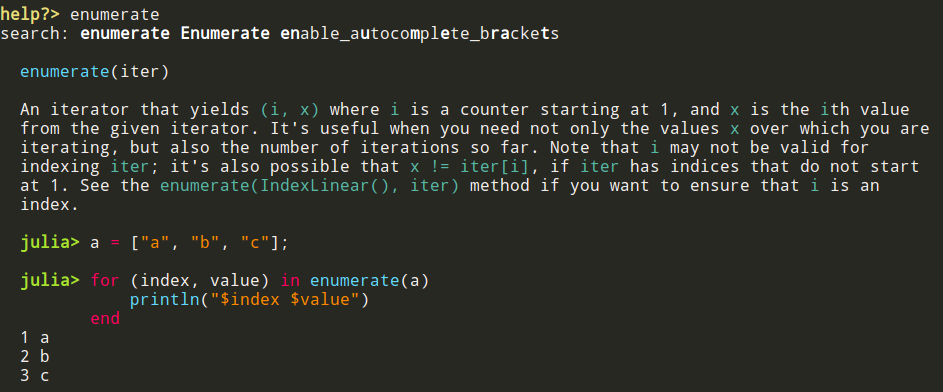

# Markdown Syntax Highlighting

OhMyREPL will by default make code blocks written in markdown syntax (for example in docstrings) highlighted with the colorscheme used by the syntax highlighter.

## Settings

Can be disabled or enabled with `enable_highlight_markdown(::Bool)`.
