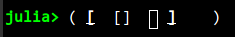
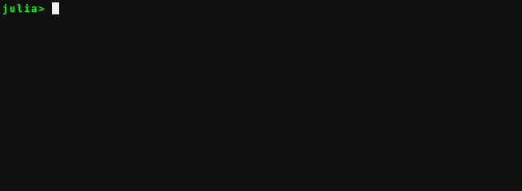
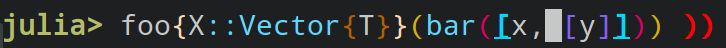
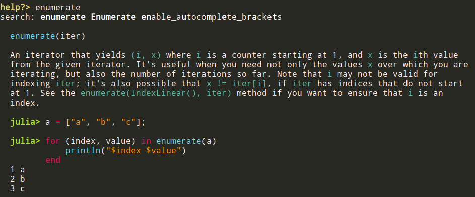

# Native REPL features

The features below used to be implemented by OhMyREPL but are native to the Julia REPL
as of Julia 1.13. They are enabled by default. OhMyREPL keeps small toggles for them
so that existing `startup.jl` files continue to work.

## Bracket highlighting

Makes the enclosing brackets highlighted when the cursor is inside a bracket pair.

Can be disabled or enabled with `OhMyREPL.enable_pass!("BracketHighlighter", ::Bool)`.

## Bracket completion

Will insert a matching closing bracket to an opening bracket automatically if this is
deemed likely to be desirable from the context of the surrounding text to the cursor.

Can be disabled or enabled with `enable_autocomplete_brackets(::Bool)`, which sets the
REPL's native `auto_insert_closing_bracket` option.

## Rainbow brackets

Colors nested brackets in different colors (with unpaired closing brackets shown with
the error face):

The colors are derived from the active colorscheme (the `julia_rainbow_*` faces).

Can be disabled or enabled with `OhMyREPL.enable_pass!("RainbowBrackets", ::Bool)`,
which sets `JuliaSyntaxHighlighting.RAINBOW_DELIMITERS_ENABLED`.

## Markdown syntax highlighting

Code blocks written in markdown syntax (for example in docstrings) are highlighted with
the active colorscheme.
