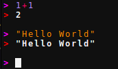
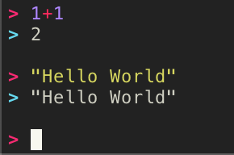
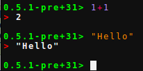

# Prompt changing

The functions

```julia
OhMyREPL.input_prompt!(str::Union{String, Function}, color::Union{Symbol, Int64})
OhMyREPL.output_prompt!(str::Union{String, Function}, color::Union{Symbol, Int64})
```

can be used to change the way that the input and output prompts are displayed.

As an example, after running:

```julia
OhMyREPL.input_prompt!("> ", :magenta)
OhMyREPL.output_prompt!("> ", :red)
```



If the first argument instead is a function, it will be run every time the prompt wants
to update which allows for more dynamic behavior.

The different possible colors can be found by typing `Base.text_colors` in the Julia REPL's help mode.
Colors in `Base.text_colors` can be called by names (e.g. `:red`, `:green`) or by an integer from 0 to 255 inclusive. 

As an example after, running:

```julia
OhMyREPL.input_prompt!("> ", 13)
OhMyREPL.output_prompt!("> ", 14)
```




!!! hint
    You can use something like `OhMyREPL.input_prompt!(string(VERSION) * ">", :green)`
    to show which version of Julia you are currently running.

    
