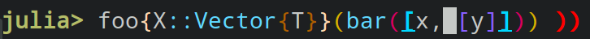

# Rainbow Brackets

Rainbow brackets is a feature that colors matching brackets in the same color (with non matching closing brackets are showed in bold red):



There are two modes of this pass, one that uses 256 colors and one that uses only the 16 system colors.
By default, we default to using the 16 color mode on Windows and 256 color mode otherwise. Changing between the modes is done by:

```
OhMyREPL.Passes.RainbowBrackets.activate_16colors()
OhMyREPL.Passes.RainbowBrackets.activate_256colors()
```

As with all different passes, this can be enabled or disabled with the function `OhMyREPL.enable_pass!("RainbowBrackets", enable::Bool)`
where `enable` determines wether if the pass is enabled or disabled.

Inspired by the [VSCode plugin with the same name](https://marketplace.visualstudio.com/items?itemName=2gua.rainbow-brackets).