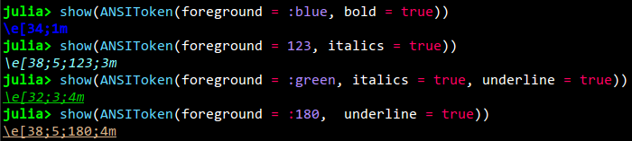
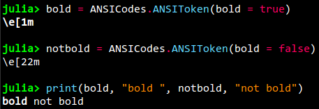
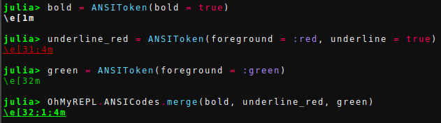

# ANSIToken

!!! note
    Some reading of how colors and text styles are printed in a terminal might be good before reading this section, see the [Wiki article](https://en.wikipedia.org/wiki/ANSI_escape_code) and [this link](http://misc.flogisoft.com/bash/tip_colors_and_formatting)

The `ANSIToken` type defined in the exported `ANSICodes` module is the object that makes the text from `OhMyREPL` gets it color and bold / italics.


## Creating an `ANSIToken`

Creation of an `ANSIToken` is done with the constructor:

```jl
ANSIToken(;foreground, background, bold, italics, underline)
```

The types of  the `foreground` and `background` keywords can either be a `Symbol` or an `Int`.

The different possible symbols are: `:default`, `:black`, `:red`, `:green`, `:yellow`, `:blue`, `:magenta`, `:cyan`, `:light_gray`, `:dark_gray`, `:light_red`, `:light_green`, `:light_yellow`, `:light_blue`, `:light_magenta`, `:light_cyan`, `:white`.

Too see how these colors look in your terminal there is the `ANSICodes.test_ANSI()` function.

In case the argument type is an integer it should be between 0 and 256. To see what color each number represent there is the `ANSICodes.test_ANSI_256()` function.

!!! note
    Not all terminals support the 256 color version, for example the default Windows command prompt does not. On Windows you can install for example [mintty](https://mintty.github.io/) which has better color support. On other OS's consult Google for how to enable 256 color support for the terminal.

If you want to convert between RGB hex codes and the 256 color codes the script [at this link](https://gist.github.com/MicahElliott/719710) is quite useful.

The keyword arguments `bold`, `italics`,  and `underline` are simply bools representing if the text should have that attribute.

An `ANSIToken` can be `show`-ed which will print the ANSI code of it in the style that successive text will be printed in.



## Using an `ANSIToken`

By printing an `ANSIToken` to the terminal it sets up the following printed text to be printed in the style defined by the token. To print a text in the format of the `ANSIToken` simply print the token first followed by the text:


!!! note
    Simply printing a new token will not reset previously activated tokens. For example, if you have started printing in bold, printing a token that sets the foreground to a color will not stop the bold from still being in effect. To reset everything, there is a `ANSICodes.ResetToken` that resets the printing to the default state:

    

    If you create a token that actually has `bold = false` then it will of course change the bold mode:

    

## Merging `ANSIToken`s

Two or more `ANSIToken`s can be merged creating a new `ANSIToken` that has all properties of the merged ones. If two of the `ANSIToken` specify the same property (for example the foreground color) then the property of the last token in the argument list is used:



The resulting token in the figure above is green because the foreground of the `green` token overrides the foreground in the `underline_red` one.


