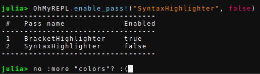
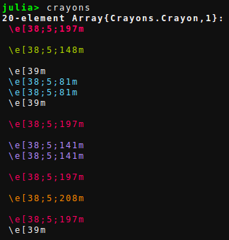

# Passes

In `OhMyREPL` each plugin that changes the way text is printed to the REPL is implemented as a **pass**. A **pass** is defined as a function (or a call overloaded type) that takes a list of Julia tokens from [`Tokenize.jl`](https://github.com/KristofferC/Tokenize.jl), a list of `ANSIToken`s, the position of the cursor and sets the `ANSIToken`s to however the pass wants the Julia tokens to be printed. Both the [Syntax highlighting](@ref) and the [Bracket highlighting](@ref) are implemented as passses.

All the passes are registered in a global pass handler. To show all the passes use `OhMyREPL.showpasses()`:

```jl
julia> OhMyREPL.showpasses()
----------------------------------
 #   Pass name             Enabled  
----------------------------------
 1   BracketHighlighter    true     
 2   SyntaxHighlighter     true     
----------------------------------
```

A pass can be enabled or disabled at will with `OhMyREPL.enable_pass!(pass_name::String, enabled::Bool)`. As an example, we disable the syntax highlighting:



## How a pass works

This section shows how text from the REPL get transformed into syntax highlighted text. The sample text used is:

```jl
str = "function f(x::Float64) return :x + 'a' end"
```

First the text is tokenized with [`Tokenize.jl`](https://github.com/KristofferC/Tokenize.jl):

```jl
julia> using Tokenize

julia> tokens = collect(Tokenize.tokenize(str))
20-element Array{Tokenize.Tokens.Token,1}:
  1,1-1,8:          KEYWORD           "function"
  1,9-1,9:          WHITESPACE        " "       
  1,10-1,10:        IDENTIFIER        "f"       
  1,11-1,11:        LPAREN            "("       
  1,12-1,12:        IDENTIFIER        "x"       
  1,13-1,14:        OP                "::"      
  1,15-1,21:        IDENTIFIER        "Float64"
  1,22-1,22:        RPAREN            ")"       
  1,23-1,23:        WHITESPACE        " "       
  1,24-1,29:        KEYWORD           "return"  
  1,30-1,30:        WHITESPACE        " "       
  1,31-1,31:        OP                ":"       
  1,32-1,32:        IDENTIFIER        "x"       
  1,33-1,33:        WHITESPACE        " "       
  1,34-1,34:        OP                "+"       
  1,35-1,35:        WHITESPACE        " "       
  1,36-1,38:        CHAR              "'a'"     
  1,39-1,39:        WHITESPACE        " "       
  1,40-1,42:        KEYWORD           "end"     
  1,43-1,42:        ENDMARKER         ""
```

A vector of `Crayon`s of the same length as the Julia tokens is then created and filled  with empty tokens.

```
crayons = Vector{Crayon}(length(tokens));
fill!(crayons, Crayon()) # Crayon is a bits type so this is OK
```

These two vectors are then sent to the syntax highlighter pass together with an integer that represent what character offset the cursor currently is located. The syntax highlighter does not use this information but the bracket highlighter does.

```
OhMyREPL.Passes.SyntaxHighlighter.SYNTAX_HIGHLIGHTER_SETTINGS(crayons, tokens, 0)
```

Running this function has the effect of updating the `crayons` vector. If we print this vector we see that they have been updated:



To print the original string with the updated vector of `Crayon`s we use the `OhMyREPL.untokenize_with_ANSI([io::IO], crayons, tokens)` function as:


Each registered and enabled pass does this updating and the contributions from each pass to the `ANSIToken` vector is merged in to a separate vector. After each pass is done, the result is printed to the REPL.

## Creating a pass

This section shows how to create a very pass that let the user define a `Crayon` for each type assertion / declaration that happens to be a `Float64`.

!!! info
    Please refer to the [Tokenize.jl API](https://github.com/KristofferC/Tokenize.jl#api) section and the  [`Crayons.jl` documentation](https://github.com/KristofferC/Crayons.jl) while reading this section.

We start off with a few imports and creating a new type which will hold the setting for the pass:

```jl
using Compat # For the call overloading syntax
using Crayons
import Tokenize.Tokens: Token, untokenize, exactkind
using OhMyREPL

type Float64Modifier
    crayon::Crayon
end

# Default it the underlined red:
const FLOAT64_MODIFIER = Float64Modifier(Crayon(foreground = :red, underline= true))
```

We then use call overloading to define a function for the type. The function will update the `Crayon` if the previous token was a `::` operator and that the current token is a `Float64` identifier, as in `::Float64`.

```jl
# The pass function, the cursor position is not used but it needs to be given an argument
@compat function (float64modifier::Float64Modifier)(crayons::Vector{Crayon}, tokens::Vector{Token}, cursorpos::Int)
    # Loop over all tokens and crayons
    for i in 1:length(crayons)
        if untokenize(tokens[i]) == "Float64"
            if i > 1 && exactkind(tokens[i-1]) == Tokenize.Tokens.DECLARATION
                # Update the crayon
                crayons[i] = float64modifier.crayon
            end
        end
    end
end
```

### Testing the pass

A pass can be tested with the `OhMyREPL.test_pass([io::IO], pass, str::String)` where `str` is a test string to test the pass on:


### Register the pass

To register and start using the pass simply use `OhMyREPL.add_pass!(passname::String, pass)`:

```jl
julia> OhMyREPL.add_pass!("Redify Float64", FLOAT64_MODIFIER)
----------------------------------
 #   Pass name             Enabled  
----------------------------------
 1   Redify Float64        true     
 2   BracketHighlighter    true     
 3   SyntaxHighlighter     true     
----------------------------------
```

We can now try it out together with the other passes by writing some syntax that includes `::Float64`:


### Modify prescedence of registered passes

We actually have a conflict now because both the syntax highlighter and the newly added pass will try to modify the properties of the printed `Float64` token. This is where the **prescedence** of each pass come in. The order of each pass is executed from bottom up in the list given by `OhMyREPL.show_passes()`. As can be see above, the new pass has the highest prescedence which is why the color of `Float64` is actually red.

The prescedence of a pass can be modified with the `OhMyREPL.prescedence!(pass::Union{String, Int}, prescedence::Int)`. The variable `pass` here is either the name of the pass or its number as given by `OhMyREPL.show_passes()`. We now set the prescedence of the new pass to 3:

```jl
julia> OhMyREPL.prescedence!("Redify Float64", 3)
----------------------------------
 #   Pass name             Enabled  
----------------------------------
 1   BracketHighlighter    true     
 2   SyntaxHighlighter     true     
 3   Redify Float64        true     
----------------------------------
```

Rewriting the same string in the REPL as above we now get:


The foreground color of `Float64` is now determined by the Syntax highlighter pass. Note that the syntax highlighter does not touch the underlining so that one is still kept from the new pass.
